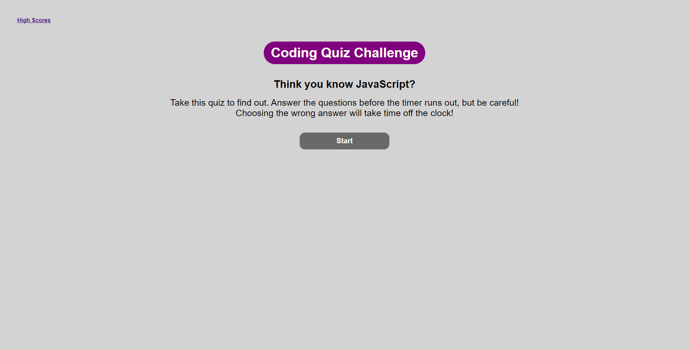

# Christopher Biertzer Portfolio

## Purpose
A Javascript challenge designed by UW Madison coding bootcamp, to build an interactive quiz.

## Instructions
load index.html in a browser to take the quiz. When ready, click the start button and the quiz will begin. In under 60 seconds, answer the questions by clicking the answer buttons. Each wrong answer will decrement your time by 15 seconds. The quiz is over when each question is answered, or the clock hits zero. At the end of the quiz, enter your name to see your name in the high score list!

## Built With
* HTML
* CSS
* JavaScript

## Application
https://cbiertz.github.io/js-quiz/

## Screenshots

## Contribution
Made with ❤️ by Chris Biertzer

### ©️2020 Cbiertz
